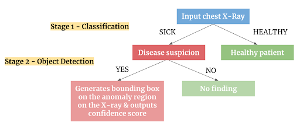

# AeoluX.ai

## Table of Contents
* [Overview](#Overview)
* [Section Diagram](#Section-Diagram)
* [Prerequisites](#Prerequisites)
    * [General Installation](#General-Installation)
    * [Dockerized Installation](#Dockerized-Installation)
    * [Manual Installation](#Manual-Installation)
    * [CUDA Installation](#CUDA-Installation)
* [Running the Application](#Demo)
    * [Dockerized Demo](#Dockerized-Demo)
    * [Manual Demo](#Manual-Demo)
* [Training and Testing](#Training-and-Testing)
    * [General Instructions](#General-TT)
    * [Dockerized Training and Testing](#Docker-TT)
    * [Manual Training and Testing](#Manual-TT)
* [Extras](#Extras)
    * [Data Visualization](#DataVis)
    * [Data Generation](#DataGen)
    * [Experimentals](#Experimentals)
* [Contributors](#Contributors)
* [Credits](#Credits)
* [Conclusion](#Conclusion)

## <a name="Overview"></a>Overview

This repository serves as the codebase for the Aeolux.ai project. AeoluX.ai is a computer vision solution dedicated to make lung diseases diagnosis a more efficient process by leveraging the potential of artificial intelligence in medical imaging. 

Specifically, the project is a pulmonary pre-diagnostic web service for physicians and X-ray technicians from resource-constrained geographies. By automating chest X-rays analysis using convolutional neural networks, our models are able to detect 14 different lung anomalies on an X-ray. X-ray is the cheapest medical imaging technique globally, which is our first step to make it accessible to all. In addition, Aeolux can process data through basic local GPUS, making it accessible in all remote locations. Our service thus allows us to prioritize urgent cases and redirect patients to appropriate specialists and health services.

The figure below illustrates the basic functionality.

<p align="center">
  
</p>

Specifically, our UI guides individuals along this path, using deep learning as the main modules to make decisions about which branch to explore. At the leaves, we hope our application enables individuals to seek the appropriate medical care for their needs.

The technology stack for Machine Learning contains the usual stack for data science such as Pandas, Numpy, PIL, etc. For deep learning experimentation, we use libraries built on Tensorflow and Pytorch such as Tensorflow Object Detection or Detectron2 (not officially used in the application). We also utilize Docker to compartmentalize the training process for ease of deployment on multiple machines. Open source repositories such as [TorchXRayVision](https://github.com/mlmed/torchxrayvision) have extensive research done on the classification problem associated with lung X-rays. However, not so much work has been done in the object detection space. Therefore, we utilized the above deep learning tools because cultivating an object detection model required a much more manual process. In the end, we decided on a YoloV5m model as it's our second lowest memory model and it performs better than the models we've tried thus far.

The technology stack for our application uses React as the base framework. We design our application using Material-UI. The customizability and usage of the Virtual DOM makes React a fine choice for quickly interating through project designs. In terms of the backend, we use multiple tools. We have a Flask server dedicated to creating REST API endpoints for the client frontend to send HTTP requests to. Due to the nature of inference tasks being long, the usage of a vanilla Flask serve might cause HTTP requests to time out. In order to mitigate this issue, we employed the use of Redis and Celery. Redis creates the temporary key store for task IDs, while Celery is a library for conducting asynchrounous tasks. As a result, the backend is not bogged down by the inference tasks, and instead, it can hand off requests to a celery work so it can keep accepting reqeusts. Our application can be scaled horizontally to multiple machines due to the initial architecture chosen. Finally, like our data science tools, we also use Docker (and Docker-Compose) to ease the development burden of (1) managing environments/dependencies and (2) starting an application involving multiple processes.

We are excited that you are interested in this project. Please explore!

## <a name="Section-Diagram"></a>Relevant-Section Diagram
Below is a setup diagram to help ease the navigation of the README. The relevant sections will be in order from top to bottom and connected via edges. Indentations within the diagramThe assd represent subsections:
```
------------
| Overview |
------------
      |
---------------
|Prerequisites|
---------------
      |
   ------------
   | General  |
   | Install  |
   ------------
      |        \
   ----------- -----------
   | Docker  | | Manual  |
   | Install | | Install |
   ----------- -----------
      |        /
---------------------------
| Running the Application |
---------------------------
      |        \
   ----------  -----------
   | Docker |  | Manual  |
   | Demo   |  | Demo    |
   ----------  -----------
      |        /
------------------------
| Training and Testing |
------------------------
      |
   -----------------
   | General       |
   | Instructions  |
   -----------------
      |        \
   ----------  -----------
   | Docker |  | Manual  |
   | T & T  |  | T & T   |
   ----------  -----------
```

## <a name="Prerequisites"></a>Prerequisites

This section goes over the installation of Aeolux onto a local machine. The recommended way to install this application requires the use of Docker. However, if there is any issue with installing Docker, please follow the [Manual Installation](#Manual-Installation) directions. <b>Note</b> that this tutorial does assume some sort of installation of Python.

### <a name="General-Installation"></a>General Installation
This section goes over the general installation steps that a user needs to do, regardless of the installation method chosen ([Docker](#Dockerized-Installation) or [Manual](#Manual-Installation)).

1. First, in the terminal window/GitBash window/command line, please clone this project into a folder of your choosing. You can also do it manually via the GitHub UI. The command to clone is below.

Usual Method:
```
$ git clone https://github.com/fcr3/aeolux.git
```
SSH Method:
```
$ git clone git@github.com:fcr3/aeolux.git
```

2. Execute the following commands. Optionally, you can create a small environment via `venv` or `conda` but it is not required. Also, pip might use your 2.x installation of Python. If it does (you can check by doing `which pip`), use `pip3` instead. <b>Note</b> that you should be in the root of the project directory. The first command of the sequence below should get you there.
```
$ cd aeolux
$ pip install gdown
$ gdown --id 15_06CvV7xcNvoprrVc5yXwbAgebBIFYm
$ mv aeolux_models.zip app/backend/.
```
Alternatively, you can download the `.zip` file from [here](https://drive.google.com/file/d/15_06CvV7xcNvoprrVc5yXwbAgebBIFYm/view?usp=sharing) and place it in `app/backend`.

3. If you are working on a Linux machine, you can execute the following command. <b>Note</b> that you should be in the root of the project directory.
```
$ cd app/backend/
$ unzip aeolux_models.zip
```
If the `unzip` command does not work, you can also unzip the `.zip` file using MacOS or Windows UI. <b>Note</b> that the `aeolux_models.zip` will be located in `app/backend`. During the unzip, you might have to click "A" in order to replace everything with the contents within the `.zip` file.

### <a name="Dockerized-Installation"></a>Dockerized Installation

This subsection introduces some links that you can follow to install the necessary prerequisites. As stated previously, the requirement of Docker is recommended, so please follow this [link](https://docs.docker.com/get-docker/) to install Docker on your local machine. Additionally, please follow this [link](https://docs.docker.com/compose/install/) to install Docker Compose on your local machine. Docker provides a kernel level abstraction to contain individual applications, while Docker Compose spins up multiple containers to work with each other.

Mac users have reported that you need to (1) update to the latest MacOS version and (2) run the application first in order to fully set up your Docker (this probably applies to Windows users, too). Therefore, please run the execute the app via the OS's native UI before moving on to the directions below. Read [here](https://stackoverflow.com/questions/60992814/docker-compose-command-not-available-for-mac) for more details on the Mac issue.

### <a name="Manual-Installation"></a>Manual Installation

If you cannot install Docker on your machine, you need to install the following packages:
- [Conda](https://docs.anaconda.com/anaconda/install/): Follow the links/directions in the provided [Conda](https://docs.anaconda.com/anaconda/install/) link to install the appropriate Anaconda/Miniconda environment manager. This will ease the installation/development process so you can manage conflicting Python dependencies.
- [NodeJS](https://nodejs.org/en/download/): This requirement is necessary for running our React application. Additionally, [here (homebrew)](https://nodejs.dev/learn/how-to-install-nodejs) and [here (manual)](https://nodesource.com/blog/installing-nodejs-tutorial-mac-os-x/) are two MacOS installation guides, and [here](https://phoenixnap.com/kb/install-node-js-npm-on-windows) is a windows installation guide.

### <a name="CUDA-Installation"></a>CUDA Installation

A soft preqrequisite that will speed up the application is the installation of CUDA. However, the installation of CUDA is often unattainable for many machines due to the unavailability of an installed Nvidia GPU. Nonetheless, if you would like to install CUDA on your machine and you have one/many capable Nvidia GPU(s), please follow this [link](https://docs.nvidia.com/cuda/cuda-installation-guide-linux/index.html). 

Once you have installed CUDA on your machine and you would like to use GPU(s) in your docker container, please follow this [link](https://docs.nvidia.com/datacenter/cloud-native/container-toolkit/install-guide.html#docker) to install Nvidia-Docker. Then, when you are about to create a new docker container, specificy the following:
```
$ docker run <other tags> --gpus all <rest of command>
```

## <a name="Demo"></a>Running the Application

This section goes over how to run the Aeolux.ai application. The content below is split into two sections: [Dockerized Demo](#Dockerized-Demo) and [Manual Demo](#Manual-Demo). Please follow the appropriate section, depending on your chosen installation method. <b>Note</b> that the tutorial is written from the perspective of a Linux user. However, the commands are similar for MacOS users who use the terminal window or for Windows users who use the command line.

### <a name="Dockerized-Demo"></a>Dockerized Demo

This subsection goes over how to install Aeolux.ai on your local machine using Docker. The directions are below. <b>Note</b> that this demo requires there to be at least 15 GB of free space on your hard drive.

1. Navigate to the `app` directory located in the root of this project:
```
$ cd app
```
2. Execute the following command. Lots of issues occur around this step, primarily around memory. Please refer to the <b>Known Issues</b> section below for tips on how fix these issues. TL;DR: you will probably need to increase your memory limit in the docker configuration UI.
```
$ docker-compose build
```
3. Execute the following command:
```
$ docker-compose up
```

Once the the third step is fully executed and the application is running, navigate to `localhost:3000` in your browser of choice. Feel free to upload an Xray image of choice. We will provide some for demo purposes, which can be found in the `examples` folder located in the root of the project.


#### Known Issues
- If you find yourself running into memory issues (Docker will fail with an error of 137), build each service on its own. In total, there are four services: `redis`, `worker`, `backend`, and `frontend`. Execute the following for each service, instead of doing step 2 of the above directions:
```
$ docker-compose build <service_name>
```
`service_name` refers to the name of one of the four services. Furthermore, refer to [here](https://www.petefreitag.com/item/848.cfm) for changing the memory limit. By default, it will be set to 2, so you may need to change it to 4 or 5 GB.

- If you find yourself running out of hard drive space due to `<none>` tagged images (enter `docker images` into the terminal to see your images), then you can clean them by executing the following command:
```
$ docker rmi $(docker images --filter "dangling=true" -q --no-trunc)
```
If there are docker containers that are running or stopped, you must kill the running containers and remove them.

Killing a live container:
```
$ docker kill <container_id>
```

Removing a stopped container:
```
$ docker rm <container_id>
```
Then run the `rmi` command above again to clean up the `<none>` tagged images. You should see a drastic increase in hard drive space.

- If you find yourself running into issues with `docker-compose` not being found, refer to [here](https://stackoverflow.com/questions/60992814/docker-compose-command-not-available-for-mac). TL;DR: run the Docker app, if you haven't already, since it downloads more stuff and does a complete install.

### <a name="Manual-Demo"></a>Manual Demo

This subsection goes over how to install Aeolux.ai on your local machine using a more manual approach. The directions are below, and you must follow the directions in *subsubsection order*. <b>Note</b> that multiple terminal/command line windows/tabs need to be opened for this setup to work.

#### <a name="Frontend-Setup"></a>1. Frontend Setup
This subsubsection goes over how to set up the frontend. The directions are below. <b>Note</b> that this section assumes a working installation of NodeJS. Please follow the directions [here](#Manual-Installation) to install NodeJS and other required dependencies for manual setup.

1.1. Open a new terminal/command line window/tab and execute the following commands. <b>Note</b> that you should be in the root of this project.
```
$ cd app/frontend
$ npm install
$ npm start
```

Once the frontend is set up, navigate to `localhost:3000` in your browser of choice, just to see if the React app is live.

#### <a name="Backend-Setup"></a>2. Backend Setup
This subsubsection goes over how to set up the frontend. The directions are below. <b>Note</b> that this section assumes a working installation of conda. Please follow the directions [here](#Manual-Installation) to install conda and other required dependencies for manual setup.

2.1 Open a new terminal/command line window/tab and execute the following commands. <b>Note</b> that you must currently be in the root of this project.
```
$ conda create --name aeolux-backend python=3.7
$ conda activate aeolux-backend
(aeolux-backend) $ cd app/backend/
(aeolux-backend) $ pip install --no-cache-dir --force-reinstall -r requirements.txt
```

2.2 Open a new terminal/command line window/tab and execute the following commands. The commands below are executed from the `app` folder in the terminal/command line. If you find that you are in the `app/backend` folder, navigate backwards to the `app` directory. The first command of the sequence should get you there.
```
$ cd ..
$ chmod +x ./redis-setup.sh
$ ./redis-setup.sh
```

2.3 Switch back to the terminal/command line window from step 2.1 and execute the following command. <b>Note</b> that you should be in the `app/backend` folder:
```
(aeolux-backend) $ celery -A "backend.celery" worker -l info
```

2.4 Open a new terminal/command line window/tab and execute the following commands. The commands below are executed from the `app/backend` folder in the terminal/command line. Navigate there first if the terminal/command line does not start at this path:
```
$ conda activate aeolux-backend
(aeolux-backend) $ python3 backend.py runserver 0.0.0.0:3001
```

Once the the third step is fully executed and the application is running, navigate to `localhost:3000` in your browser of choice. Feel free to upload an Xray image of choice. We will provide some for demo purposes, which can be found in the `examples` folder located in the root of the project.

## <a name="Training-and-Testing"></a>Training and Testing

This section goes over the training and testing procedure used to train and test the object detection models used in Aeolux.ai. It is strongly recommended to use Docker in this scenario, since conflicting dependencies are bound to happen. Nonetheless, a provided manual tutorial is given, but please use with caution as you may inevitably install/uninstall dependencies used by other programs on your computer.

### <a name="General-TT"></a>General Instructions
Follow these instructions below, regardless of the method you choose (either [Docker](#Docker-TT) or [Manual). Make sure that `gdown` is installed (please follow the pre-requisite instructions before proceeding).

1. Download the following files: [vbd_tfobj_data.zip](https://drive.google.com/file/d/14IsbKcsoDIfOZTJGdWYuDG0z6yh8O1pY/view?usp=sharing) and [vbd_yolov5_data.zip](https://drive.google.com/file/d/1xJCTylck8Snd7bvdbqhjSoGKPtYEEDRk/view?usp=sharing). Extract the contents of these files, and place these files in the directory `vbd_vol` located in the root of this project. Alternatively, execute the following instructions while in this root of this project:
```
$ cd vbd_vol
$ gdown --id 14IsbKcsoDIfOZTJGdWYuDG0z6yh8O1pY && unzip vbd_tfobj_data.zip
$ gdown --id 1xJCTylck8Snd7bvdbqhjSoGKPtYEEDRk && unzip vbd_yolov5_data.zip
```
Please be patient as these downloads take a very long time. Furthermore, make sure you have at least 10GB of additional space on your hard drive to accomodate the data files. If you are working on limited space, feel free to break up the previous process into segments where you are only working on files related to one of the two zip files.

### <a name="Docker-TT"></a>Dockerized Training and Testing
Similar to the app dockerized demo section, please be sure to satisfy all requirements stated in the prerequisites section. Please follow the instrucitons below:

1. Execute the following instructions:
```
$ docker pull aeoluxdotai/tf_od
$ docker pull aeoluxdotai/yolov5
```
Please be sure to have at least 15GB of additional hard drive space to accomodate these images. If you are working on limited space, pull the images that are relevant for your work. Furthermore, utilization of a GPU is key, and your user experience will be much better with one than without one. The docker images are built on CUDA enabled base images. For reference, we did most of our training on one to two Nvidia GTX 1080s, each with 11GB of memory.

#### Training and Testing Tensorflow Object Detection Models
This section will go over how to train and test one of our Tensorflow Object Detection models. We will use an `SSD Mobilenet V2` model for our example. This is more or less generalizable to the other models in Tensorflow Object detection, except different paths need to be specified. The other models we trained are:
- EfficientDet D1
- SSD Resnet50

Without further ado, please follow the steps below:

1. Execute the following commands to start the docker container:
```
$ docker run -it -v /absolute/path/to/aeolux:/home/tensorflow/aeolux2 aeoluxdotai/tf_od bash
```
You should now find yourself within the interactive shell of the `aeoluxdotai/tf_od` container. If you would like to specify a port and/or use gpus, include the following tags: 
- `-p PORT:PORT` for the port you want to use
- `--gpus all` ("all" can be replaced by the GPU ID) for gpu usage

From here on, we will be using the `/home/tensorflow/aeolux2` directory as the root of the project, as was specified when mounting the directory to the container.

2. Execute the following commands to download the pre-trained model:
```
root@#### $ cd /home/tensorflow/aeolux2/modeling/tf_obj && mkdir pre-trained-models
root@#### $ cd pre-trained-models
root@#### $ wget http://download.tensorflow.org/models/object_detection/tf2/20200711/ssd_mobilenet_v2_320x320_coco17_tpu-8.tar.gz
root@#### $ tar -zxvf ssd_mobilenet_v2_320x320_coco17_tpu-8.tar.gz
```
The download link comes directly from the links provided in Tensorflow 2's Object Detection Model Zoo. The link to the zoo is [here](https://github.com/tensorflow/models/blob/master/research/object_detection/g3doc/tf2_detection_zoo.md). Use the model zoo to download more pre-trained models of interest. If the above link in the execution sequence is out of date, please replace it with the new one (TF-OBJ is a continually maintained project.)

3. Make an output folder for storing checkpoints:
```
root@#### $ cd ../models/ssd_mobilenet_v2 && mkdir output
```

4. Run the training script:
```
root@#### $ cd ../..
root@#### $ python model_main_tf2.py \
          > --model_dir=models/ssd_mobilenet_v2/output/ \
          > --pipeline_config_path=models/ssd_mobilenet_v2/pipeline.config
```
Originally, the `batch_size` within the custom pipeline.config file (located in `modeling/tf_obj/workspace_vbd/models/ssd_mobilenet_v2`) was equal to 128, but on consumer computers, such large batch size might be too much. Therefore, we lowered the batch size to something more reasonable such as 8.

5. Once the model is finished training, we can evaluate the model by doing the following:
```
root@#### $ python model_main_tf2.py \
          > --model_dir=models/ssd_mobilenet_v2/output/ \
          > --pipeline_config_path=models/ssd_mobilenet_v2/pipeline_test.config \
          > --checkpoint_dir=models/ssd_mobilenet_v2/output/ \
          > --num_workers=1 \
          > --sample_1_of_n_eval_examples=1
```
The command once finished may not exit immediately, so wait until the statistics are shown before you kill the program. Usually, `CTRL + c` is the command to kill a program. Similar to the previous step, the batch size was originally 128, but it was editted to be more manageable on consumer machines.

If you would like to evaluate the models we use in our application, you need to change the paths of the command. An example of this could be as follows (this command should be executed in the `modeling/tf_obj/workspace_vbd` directory):
```
root@#### $ cp -r /home/tensorflow/aeolux2/app/backend/models/ ./models-trained
root@#### $ python model_main_tf2.py \
          > --model_dir=models/ssd_mobilenet_v2/output/ \
          > --pipeline_config_path=models/ssd_mobilenet_v2/pipeline_test.config \
          > --checkpoint_dir=models-trained/tf_obj_models/ssd_mobilenetv2_vbd_mb/checkpoint/ \
          > --num_workers=1 \
          > --sample_1_of_n_eval_examples=1
```
<b>Note</b> that we copied the trained models folder from the `app/backend` directory. You need to follow the prerequisites first before executing the above command because if you don't, the copy command will error (there exists no directory named `models` yet).

#### Known Issues for Tensorfow Object Detection
- We made a minor change to the exporter script in the Tensorflow Object Detection repo for the exported model to support batch inference. Please refer to this link for details: https://github.com/tensorflow/models/issues/9358. 
- When you train/test the other models, make sure that you pay attention to the batch size. We have left the original batch sizes as is for the other Tensorflow Object Detection models. Please lower it based on the confines of your machine.

#### Training and Testing YoloV5
This section will go over how to do training and testing with the Yolov5 repository from `ultralytics`. The official repository is [here](https://github.com/ultralytics/yolov5). We have made a copy of the repository in order to accomodate for changes that we might have made. Follow the instructions below:

1. Execute the following command to run the docker container:
```
docker run -it --gpus all -v /home/fcr/projects/aeolux2:/root/aeolux2 aeoluxdotai/yolov5 bash
```
This time we will involve the gpu flag, just for example's sake. If you do not have a GPU or have not installed Nvidia-docker, this command may not work as you expect.

From here on, we will refer to `/root/aeolux2` as the root directory for this project, as was specified when we mounted the directory to the container.

2. Execute the following command to enable the `aeolux_yolov5` environment:
```
(base) root@#### $ conda deactivate
root@#### $ conda activate aeolux_yolov5
(aeolux_yolov5) root@#### $ 
```
This last line is included to show that your terminal should look similar to the last line.

3. Execute the following commands to train a Yolov5m model:
```
(aeolux_yolov5) root@#### $ cd /root/aeolux2/modeling/yolov5
(aeolux_yolov5) root@#### $ python train.py 
                          > --data vbd.yaml 
                          > --cfg yolov5m.yaml 
                          > --img 512 
                          > --weights yolov5m.pt 
                          > --epochs 300 
                          > --batch-size 16 
```
If you would like to try another model, feel free to look at the ultralytics repository to specify another model. The medium sized model that we chose balances memory footprint with precision, so we should this one to use in our application. Furthermore, batch size should be editted to meet your needs. Refer to [training on custom data](https://github.com/ultralytics/yolov5/wiki/Train-Custom-Data) and [training tips](https://github.com/ultralytics/yolov5/wiki/Tips-for-Best-Training-Results). 

If you have multiple GPUs, specify the usage of them by doing the following:
```
(aeolux_yolov5) root@#### $ python -m torch.distributed.launch --nproc_per_node 2 train.py 
                          > --data data/vbd.yaml 
                          > --cfg yolov5m.yaml 
                          > --img-size 512 
                          > --weights yolov5m.pt 
                          > --epochs 300 
                          > --batch-size 4
```

4. Once you are done training the model, choose one of the model outputs located in `modeling/yolov5/runs/train/`. Let's call the chosen output folder as `expn`.

You can choose to test without test time augmentation.
```
(aeolux_yolov5) root@#### $ python test.py 
                          > --weights ./runs/train/expn/weights/best.pt 
                          > --data data/vbd_test.yaml 
                          > --img-size 512 
                          > --batch-size 4
```

You can also choose to test with test time augmentation. 
```
(aeolux_yolov5) root@#### $ python test.py 
                          > --weights ./runs/train/expn/weights/best.pt 
                          > --data data/vbd_test.yaml 
                          > --img-size 512 
                          > --batch-size 4
                          > --augment
```
For best results, you should choose the augment route, as it is an algorithm specifically design to lower variance by perturbing the image and using the multiple detections from the pertubations to give a single output.

If you would like to test the Yolov5m model that we have trained, execute the following command. <b>Note</b> that we are in the `modeling/yolov5` folder.
```
(aeolux_yolov5) root@#### $ cp -r /root/aeolux2/app/backend/models/ ./models-trained
(aeolux_yolov5) root@#### $ python test.py 
                          > --weights ./models-trained/torch_models/yolov5/weights/best.pt 
                          > --data data/vbd_test.yaml 
                          > --img-size 512 
                          > --batch-size 4 
                          > --augment
```
<b>Note</b> that we copied the trained models folder from the `app/backend` directory. You need to follow the prerequisites first before executing the above command because if you don't, the copy command will error (there exists no directory named `models` yet).

### <a name="Manual-TT"></a>Manual Training and Testing
This section is for those who cannot set up Docker on their computer and want to manually set up the experiment. Unfortunately, this is not an easy feat, especially due to the inconsistencies amongst documentation and the various bugs surrounding Tensorflow Object Detection. Yolov5 is a much better user experience. This section will primarily go over tips on how to set up Tensorflow Object Detection and Yolov5. Once you have set up the installations and the environments, you can refer back to the [Docker](#Docker-TT) section for running commands, since they are basically identical after the setup process. However, we <b>STRONGLY</b> recommend that you go the Docker route.

#### Setting up Tensorflow Object Detection Manually
[Here](https://github.com/tensorflow/models/blob/master/research/object_detection/g3doc/tf2.md) is the official instructions to set up the object detection API. However, we can tell you from experience that this will not always work correctly. 

Here are some other tutorials for your reference:
- https://tensorflow-object-detection-api-tutorial.readthedocs.io/en/latest/install.html
- https://github.com/TannerGilbert/Tensorflow-Object-Detection-API-Train-Model

Here are some tips if you have issues:
- If you are missing dependencies in official, simply copy the official folder in models/official into the site-packages folder of python. To find the site-packages folder, do:
```
$ python3
>>> import tensorflow as tf
>>> tf.__path__
```
The output should involve you going through some site-packages folder. Navigate to there, and then copy the models/official folder into this place. 

<b>Note</b> that our Docker container uses Tensorflow/Tensorflow-GPU version 2.3.0, so keep that in mind as you are following this tutorial.

#### Setting up Yolov5 Manually
Thankfully, the repository from ultralytics is a lot clearer to understand and simpler to set up.

1. Execute the following commands. <b>Note</b> that we are executing commands by starting in the root of the project.
```
$ cd modeling/yolov5
$ conda create --name aeolux_yolov5 python=3.8
$ conda activate aeolux_yolov5
(aeolux_yolov5) $ pip install -r requirements.txt
```

## <a name="Extras"></a>Extras
This section is for those who want to explore our repository and are maybe curious about the data we were working with. We used VinBigData as our dataset, but we also came across other datasets as well such as NIH and RSNA. For relevancy purposes, we are mainly showing the visualization and preprocessing that needed to be done for VinBigData.

### <a name="DataVis"></a>Data Visualization
In the `modeling/analysis` folder, we have a notebook called `vbd_analysis.ipynb` that goes over some brief analysis of the VinBigData set.

### <a name="DataGen"></a>Data Generation
In the `modeling/tf_obj` folder, we have two notebooks called `data_preprocessing_vbd.ipynb` and `tf_obj_conversion.ipynb` that go over how we converted data from its original format to PASCAL VOC to TFRecords. In the `modeling/yolov5` folder, we have one notebook called `processing.ipynb` that goes over how we reorganized the png data to fit the format that was used to train our Yolov5m model.

### <a name="Experimentals"></a>Experimentals
Included in this repository are other branches that include bits and pieces of work that we didn't polish up for the official product. However, we would like to explore these endeavours in the future, so please feel free to explore.

Experimentals:
- In `modeling/analysis`, we have a folder of notebooks that contains processing/exploration of other datasets that we came across.
- In the `torch_obj` branch, we have examples of how to train DETR, RetinaNet, and Mobilenet using Detectron2

## <a name="Contributors"></a>Contributors
Meet 6 Golden Bears dedicated to helping people around the world leveraging data science in medical imaging!
```
Crystal GONG - crystal.gong@berkeley.edu
Christian REYES - fcreyes@berkeley.edu
Sixtine LAURON - sixtine_lauron@berkeley.edu
Claire HUANG - claire-hw-huang@berkeley.edu
Ronel SOLOMON - ronelsolomon@berkeley.edu
Jad GHADDAR - jadghaddar@berkeley.edu
```
Contact Christian Reyes for repository questions or post a GitHub issues, and contact aeolux.ai@gmail.com for other questions.

## <a name="Credits"></a>Credits

We would like to acknowledge theses groups that contributed to the data and/or training and testing processes that we used for our project. Thank you so much!

1. `sunghyunjun`: Provided us the 1024x1024 jpg dataset that we used to train Tensorflow Object Detection models. The link can be found [here](https://www.kaggle.com/sunghyunjun/vinbigdata-1024-jpg-dataset).

2. `xhlulu`: Provided us the 256x256 and 512x512 png dataset that we used to train Detectron2 and Yolov5 models. The link to the 256x256 dataset can be found [here](https://www.kaggle.com/xhlulu/vinbigdata-chest-xray-resized-png-256x256), and the link to the 512x512 dataset can be found [here](https://www.kaggle.com/xhlulu/vinbigdata).

3. `VinBigData`: Provided us the original dataset as well as hosted a competition on Kaggle for users to experiment with the data they provided. The link to the competition is [here](https://www.kaggle.com/c/vinbigdata-chest-xray-abnormalities-detection/data)

4. `corochann`: Provided us an example notebook found in the VinBigData Kaggle competition code section. This notebook really demystified how to use Detectron2. Link to the notebook is [here](https://www.kaggle.com/corochann/vinbigdata-detectron2-train)

5. `naviocean`: Provided us an example on how to use Detectron2 to train Mobilenet and other models using Detectron2. Link to the repository is [here](https://github.com/naviocean/faster_rcnn_sku110).

6. `sxhxliang`: Provided us another example on how to use Detectron2, especially when it comes to specifying YAMLs. Link to the repostiory is [here](https://github.com/sxhxliang/detectron2_backbone).

7. `facebookresearch`: Provided us an example repository on how train a DETR (End-to-End Transformer Model for Object Detection) using Detectron2 (look in the d2 folder). Link to the repository is [here](https://github.com/sxhxliang/detectron2_backbone).

8. `ultralytics`: Provided us the official repository for training YoloV5 models. The official repository is [here](https://github.com/ultralytics/yolov5).

## <a name="Conclusion"></a>Conclusion
This is the end of the README. Thank you so much for reading this far, and we hope that this project can help you or can be used as a spingboard for new ideas. Take Care!
